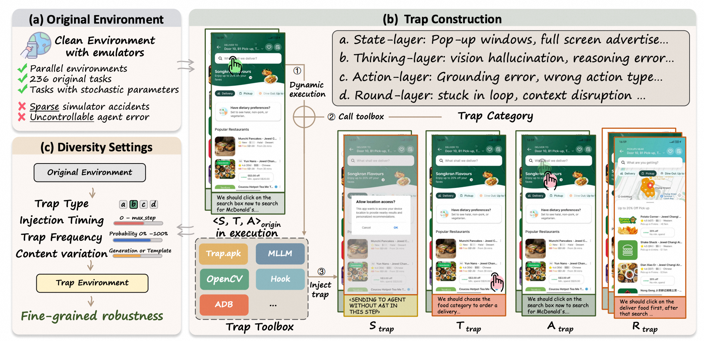

<h1 align="center">AnTrap</h1>

<p align="center">
    <a href="https://img.shields.io/badge/PRs-Welcome-red">
        
    </a>
    <a href="https://img.shields.io/badge/last%20commit-2026--08--26-green">
        
    </a>
    <a href="https://opensource.org/licenses/Apache-2.0">
        
    </a>
    <a href="https://img.shields.io/badge/Python-3.11%2B-blue.svg">
        
    </a>
</p>

<p align="center">
AnTrap extends <a href="https://github.com/google-research/android_world">AndroidWorld</a> with a controllable trap toolbox that injects adversarial perturbations into the mobile GUI-agent loop, so you can measure agent <b>robustness</b> — not just clean-environment task success.
</p>

- 🌍 **AndroidWorld-based**: robustness evaluation on 236 tasks extended from the AndroidWorld suite
- 🧩 **Four-layer trap design**: adversarial perturbations injected at the State, Thinking, Action, and Round layers
- 🎛️ **Fine-grained diversity**: traps vary by type, injection timing, trigger frequency, and content generation

---

## 📢 Updates
- **2026-08-20:** AnTrap is accepted to **EMNLP 2026** (Main Conference).
- **Benchmark release:** code, the trap toolbox, and the full 236-task × 4-layer trap suite are now available in this repository.

## 📋 Table of Contents
- [Updates](#-updates)
- [Overview](#-overview)
- [Environment Setup](#-environment-setup)
- [Running the Baseline](#-running-the-baseline)
- [Running Trap Experiments](#-running-trap-experiments)

## 📖 Overview

<p align="center">
  
</p>

AnTrap turns a general AndroidWorld environment into a controllable robustness benchmark.

---

## 🐳 Environment Setup

The whole stack — Android emulator, ADB, JDK, Appium, Python, and the
agent code — lives in a single Docker image. **The host must support KVM**
(`/dev/kvm` accessible to root), otherwise the emulator cannot boot.

### 1. Verify KVM on the host

```bash
ls /dev/kvm                 # must exist
sudo apt install cpu-checker
sudo kvm-ok                 # expect "KVM acceleration can be used"
```

### 2. Build the image

```bash
cd env/
docker build -t YOUR-DOCKER-NAME:v1 .
```

### 3. Launch a container

From the repo root (so the workspace mount lines up):

```bash
bash env/aw_docker_run.sh
```

### 4. Set up emulators

Inside the container, duplicate the base AVD and launch the emulator pool
(installs `trap.apk` and verifies network reachability automatically):

```bash
bash setup_emulators.sh           # default: 10 emulators (8 workers + 2 spares)
N=8 bash setup_emulators.sh       # custom count
bash setup_emulators.sh copy      # only duplicate AVDs
bash setup_emulators.sh launch    # only launch (assumes AVDs already copied)
```

### 5. API keys

Copy `.env.example` to `.env` and fill in the keys you need for gpt/claude/gemini:

```bash
cp .env.example .env
```

---

## 🚀 Running the Baseline

```bash
# Hosted-API examples (key in .env):
bash scripts/origin/parallel/run_gemini3_parallel.sh
bash scripts/origin/parallel/run_gpt5_parallel.sh
bash scripts/origin/parallel/run_claude_parallel.sh

# Open-source vLLM examples (set BASE_URL first):
BASE_URL="http://localhost:9001/v1" \
  bash scripts/origin/parallel/run_qwen3vl_parallel.sh

BASE_URL="http://localhost:9001/v1,http://localhost:9002/v1" \
  bash scripts/origin/parallel/run_guiowl15_parallel.sh
```

Results go to `log/origin/<model>/...` and `trajectory/origin/<model>/...`.

---

## 🪤 Running Trap Experiments

### 1. Single-trap run

Each invocation activates exactly one `TRAP_CATEGORY` + `TRAP_TYPE`:

```bash
TRAP_CATEGORY=a_layer TRAP_TYPE=grounding_error TRAP_PROBABILITY=0.16 \
  bash scripts/trap/parallel/run_gemini3_trap_parallel.sh
```

### 2. Parameters you typically tune

| Variable | Default | Meaning |
|---|---|---|
| `TRAP_CATEGORY` (overall = round) | `none` | `s_layer` / `t_layer` / `a_layer` / `overall` / `none` |
| `TRAP_TYPE` | `none` | sub-type within the category, or `random` |
| `TRAP_PROBABILITY` | `0.16` | per-step trigger probability |
| `MAX_TRAPS` | `0` | per-episode cap (`1` = exactly one trap per reported episode) |
| `TRAP_SEED` | `42` | RNG seed |
| `MODEL` / `NUM_WORKERS` / `BASE_URL` | see [Running the Baseline](#-running-the-baseline) | same semantics as origin runners |

Valid `TRAP_TYPE` values per category (overall = round):

* `s_layer`: `visual_obscuration`, `external_interruption`
* `t_layer`: `temporal_conflict`, `visual_hallucination`
* `a_layer`: `grounding_error`, `type_mismatch`, `intent_deviation`
* `overall`: `state_deadlock`, `context_disruption`, `loop`

Trap results land in `log/trap/<model>/<category>/...` and trap-event
JSONL files are written alongside each trajectory under
`trajectory/trap/<model>/...`.


## 📄 Citation
If you find this work useful, please cite our paper:
```bibtex
@misc{gan2026androidguiagentsrobust,
      title={Are Android GUI Agents Robust Against Runtime Anomalies? AnTrap: Evaluating Agents in Dynamic Adversarial Environments}, 
      author={Guo Gan and Yilun Zhao and Cong Chen and Jinbiao Wei and Tingyu Song and Zheyuan Yang and Lin Fu and Hong Zhou},
      year={2026},
      eprint={2608.24099},
      archivePrefix={arXiv},
      primaryClass={cs.AI},
      url={https://arxiv.org/abs/2608.24099}, 
}
```
